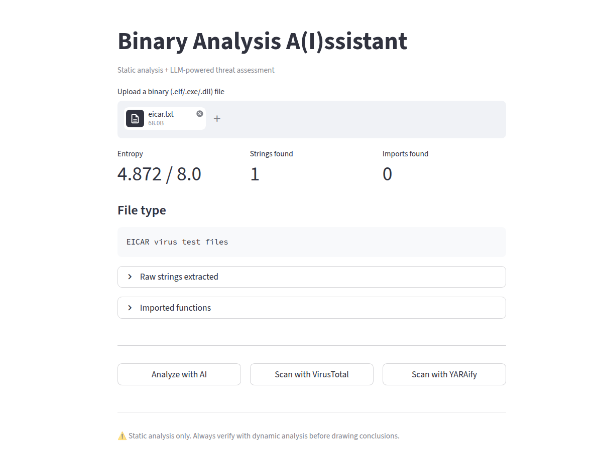
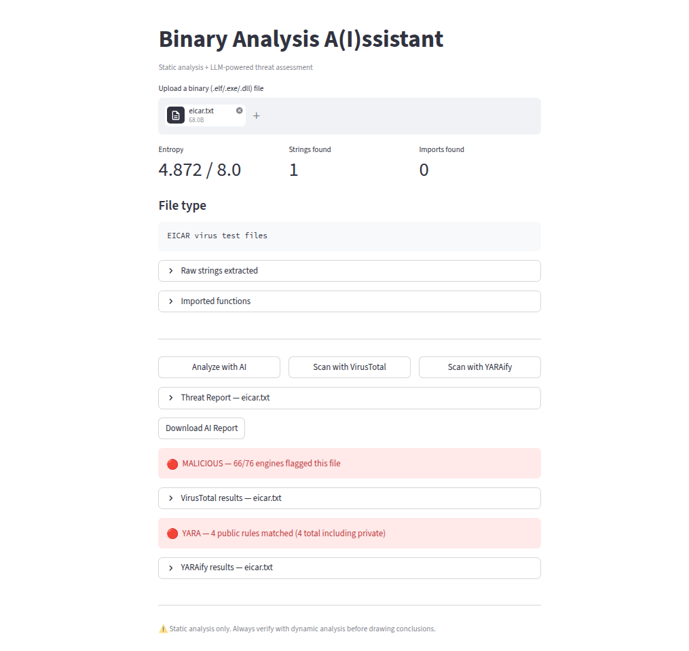

# 🔬 Binary Analysis A(I)ssistant
 
Static binary analysis powered by AI — extract features, query threat intelligence APIs, and generate structured threat reports in seconds.
 



 
**Live demo:** [georgenadejde.github.io/aiassistant](https://georgenadejde.github.io/aiassistant)
 
---
 
## Overview
 
**Binary Analysis A(I)ssistant** is a static analysis tool that combines classical reverse engineering techniques with LLM-powered threat assessment. Upload any binary — ELF, PE, DLL — and get a structured threat report without ever executing the file.
 
Built to demonstrate the intersection of hands-on cybersecurity expertise and practical AI tooling.
 
---
 
## Features
 
The tool runs four operations on any uploaded binary:
 
**Static feature extraction** pulls file type, Shannon entropy, embedded strings, and PE/ELF imports directly from the binary — no execution required.
 
**VirusTotal integration** hashes the file and queries VirusTotal's database, returning detection ratios across 70+ AV engines, known filenames, first seen dates, and per-engine verdicts.
 
**YARAify integration** submits the file to abuse.ch's scanning engine and asynchronously polls for results, including matched public YARA rules and ClamAV detections.
 
**AI-powered threat report** sends all of the above to Gemini as structured context and generates a report covering threat assessment, behavioral indicators, red flags, malware family identification, and analyst recommendations. When VirusTotal and YARAify data is available, the LLM incorporates both sources for higher confidence output.
 
Reports can be downloaded as `.txt` files.
 
---
 
## Tech stack
 
| Component | Technology |
|---|---|
| UI | Streamlit |
| LLM | Google Gemini 2.5 Flash (via `google-genai`) |
| AV threat intel | VirusTotal API v3 (via `vt-py`) |
| YARA threat intel | YARAify API (abuse.ch) |
| Binary parsing | `pefile` (PE), `pyelftools` (ELF) |
| Feature extraction | `strings`, `file`, `sha256sum`, Shannon entropy |
| Deployment | Streamlit Community Cloud |
 
---
 
## How it works
 
```
Binary uploaded
      │
      ▼
Static Analysis (static_analysis.py)
  ├── File type       → `file` command
  ├── Entropy         → Shannon entropy (byte frequency distribution)
  ├── Strings         → `strings` command (min length 6)
  ├── Imports         → pefile (PE/DLL) / pyelftools (ELF)
  └── SHA-256 hash    → sha256sum
 
      │
      ├─────────────────────┬──────────────────────┐
      ▼                     ▼                      ▼
VirusTotal lookup     YARAify scan             Gemini API
  Hash → 70+ AV        Submit file →         Always available
  engine verdicts       async poll →
                        YARA + ClamAV
      │                     │                      │
      └─────────────────────┴──────────────────────┘
                            ▼
                     Structured Threat Report
```
 
YARAify scanning is asynchronous. The tool submits the file, receives a `task_id`, then polls every 3 seconds until results are ready (up to 60 seconds). This is handled transparently in the background.
 
---
 
## Running locally
 
**Prerequisites:** Python 3.12+, Linux (relies on `strings`, `file`, and `sha256sum`)
 
```bash
git clone https://github.com/georgenadejde/ai-binary-analyzer
cd ai-binary-analyzer
 
python -m venv venv
source venv/bin/activate
 
pip install -r requirements.txt
 
cp .env.example .env
# Fill in your API keys
```
 
Then run with:
 
```bash
streamlit run app.py
```
 
All three API keys are free and require no credit card. Get them at [aistudio.google.com](https://aistudio.google.com) (Gemini), [virustotal.com](https://virustotal.com), and [auth.abuse.ch](https://auth.abuse.ch) (YARAify).
 
---
 
## Project structure
 
```
ai-binary-analyzer/
├── app.py                  # Streamlit UI + session state management
├── static_analysis.py      # Binary feature extraction
├── analyzer.py             # Gemini API integration + prompt engineering
├── scan_file.py            # VirusTotal API integration
├── yara_scan.py            # YARAify API integration (async submit + poll)
├── requirements.txt
├── .env.example
└── README.md
```
 
---

## Limitations

- **Static analysis only**: the binary is never executed. Dynamic behavior (network calls, file writes, process spawning at runtime) is not observed, only inferred from imports and strings.
- **Linux only**: depends on `strings`, `file`, and `sha256sum` being available on the host system.
- **VirusTotal free tier**: limited to 4 requests/minute. Hashes not in VT's database return a not-found error.
- **YARAify queue times**: processing can take 15–60 seconds depending on server load.
- **LLM output**: AI analysis should be treated as a starting point for investigation, not a definitive verdict. Always verify findings with dynamic analysis.

---

[georgenadejde.github.io](https://georgenadejde.github.io) · [LinkedIn](https://linkedin.com/in/george-nadejde) · [GitHub](https://github.com/georgenadejde)